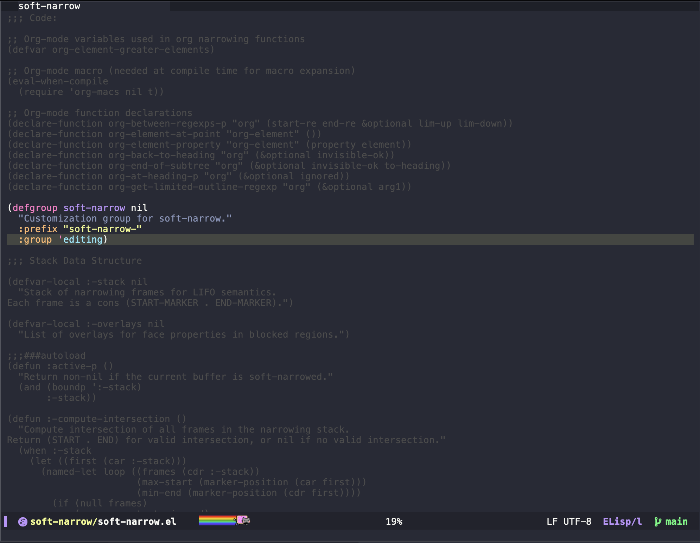

#+title: soft-narrow

[[https://github.com/takeokunn/soft-narrow/actions/workflows/ci.yml][file:https://github.com/takeokunn/soft-narrow/actions/workflows/ci.yml/badge.svg]]

Emacs package to imitate =narrow-to-region= with more eye-candy.

Unlike =narrow-to-region=, which completely hides text outside the narrowed region, this package simply deemphasizes the text, makes it readonly, and makes it unreachable. This leads to a much more natural feeling, where the region stays static (instead of being brutally moved to a blank slate) and is clearly highlighted with respect to the rest of the buffer.

This package was inspired by [[https://github.com/Malabarba/fancy-narrow][fancy-narrow]] by Artur Malabarba, and reimplemented from scratch using modern Emacs 29.1+ APIs.

* Features

- *Minimal overhead* — no function advising; buffer-local =pre-command-hook= and =post-command-hook= for boundary handling, installed only while narrowing is active
- *Stackable narrowing* — true intersection semantics for progressive focusing
- *Region-scoped commands* — run buffer-scanning commands (org export, =mark-whole-buffer=, …) scoped to the visible region via =soft-narrow-execute= / =soft-narrow-with-restriction=
- *Pure declarative approach* — uses overlays for visual deemphasis, =cursor-intangible= and =read-only= text properties for behavior
- *Lightweight* — single-file implementation (~400 lines including org-mode integrations)

* Prerequisites

- Emacs 29.1+

* Installation

** use-package (once available on MELPA)

#+begin_src emacs-lisp
(use-package soft-narrow
  :ensure t
  :config (soft-narrow-mode 1))
#+end_src

** leaf

#+begin_src emacs-lisp
(leaf soft-narrow
  :vc (:url "https://github.com/takeokunn/soft-narrow")
  :global-minor-mode t)
#+end_src

** Manual

Clone this repository and add it to your =load-path=:

#+begin_src emacs-lisp
(add-to-list 'load-path "/path/to/soft-narrow")
(require 'soft-narrow)
#+end_src

Or download =soft-narrow.el=, open it in Emacs, and use =M-x package-install-from-buffer=.

* Usage

The [[file:example/][example/]] directory contains sample files for interactive testing:
- =sample.el= — Emacs Lisp file with multiple defuns (try =C-x n d= to narrow to defun)
- =sample.org= — Org file with headings and blocks (try =C-x n s= to narrow to subtree)

1. Simply call =soft-narrow-to-region= to see it in action. To widen the
   region again afterwards use =soft-narrow-widen=.

2. If you activate the global minor mode (=soft-narrow-mode=), then the
   standard narrowing keys (=C-x n n=, =C-x n w=, etc) will make use of soft-narrow.
   Disabling the mode automatically widens all narrowed buffers.

3. You can narrow to multiple regions in sequence.
   Each successive narrow creates an intersection of all narrowed regions,
   allowing you to progressively focus on specific parts of your buffer.

** Commands

| Key (with =soft-narrow-mode=) | Command | Description |
|---+---+---|
| =C-x n n= | =soft-narrow-to-region= | Narrow to the active region |
| =C-x n w= | =soft-narrow-widen= | Widen (pop one narrowing level) |
| =C-x n d= | =soft-narrow-to-defun= | Narrow to the current defun |
| =C-x n p= | =soft-narrow-to-page= | Narrow to the current page |
| =C-x n b= | =soft-narrow-org-to-block= | Narrow to org block |
| =C-x n e= | =soft-narrow-org-to-element= | Narrow to org element |
| =C-x n s= | =soft-narrow-org-to-subtree= | Narrow to org subtree |
| =C-x n x= | =soft-narrow-execute= | Run a command scoped to the soft-narrow region |

Use =soft-narrow-active-p= to check if soft-narrowing is active in the current buffer.

* Stackable Narrowing

soft-narrow supports stackable narrowing with *true intersection* semantics:

#+begin_src emacs-lisp
;; Example 1: Overlapping regions
(soft-narrow-to-region 1 100)   ; Narrow to lines 1-100
(soft-narrow-to-region 50 150)  ; Further narrow to lines 50-150
;; Visible region: 50-100 (intersection)

;; Example 2: Widening
(soft-narrow-widen)  ; Returns to 1-100
(soft-narrow-widen)  ; Returns to full buffer
#+end_src

*Non-overlapping regions* produce an empty intersection:
#+begin_src emacs-lisp
(soft-narrow-to-region 100 200)  ; Lines 100-200
(soft-narrow-to-region 300 400)  ; Lines 300-400 (no overlap)
;; Result: intersection is empty, all narrowing properties are cleared.
;; Use soft-narrow-widen to pop back and restore the previous region.
#+end_src

* Scoping Commands to the Region

soft-narrow keeps =point-min= / =point-max= pointed at the *whole* buffer so the surrounding text stays visible. The trade-off is that commands which *scan the accessible buffer* do **not** see the narrowing and operate on the entire buffer, for example:

- =org= export (=C-c C-e=) exports the whole file, not the narrowed subtree
- =mark-whole-buffer= (=C-x h=) marks the whole buffer
- =count-words=, =sort-lines=, =fill-region=, =org-babel-execute-buffer=, etc.

This is *inherent*: Emacs ties the accessible portion of a buffer to the displayed portion, so a purely visual narrowing cannot automatically restrict these commands. Real =narrow-to-region= scopes them precisely because it hides the surrounding text — the exact thing soft-narrow avoids.

To scope such an operation to the visible region on demand, soft-narrow applies a *genuine* =narrow-to-region= only for the duration of that operation:

- =C-x n x= (=soft-narrow-execute=) — read a command and run it scoped to the region
- =soft-narrow-org-export-dispatch= — org export scoped to the region (bind to taste, e.g. in place of =C-c C-e=)
- =soft-narrow-with-restriction= — a macro for use in your own code/config:

#+begin_src emacs-lisp
;; Any buffer-scanning operation, scoped to the soft-narrow region:
(soft-narrow-with-restriction
  (org-export-as 'html))

;; Bind org export to run scoped while soft-narrowing:
(with-eval-after-load 'org
  (define-key org-mode-map (kbd "C-c C-e")
    (lambda () (interactive)
      (if (soft-narrow-active-p)
          (soft-narrow-org-export-dispatch)
        (org-export-dispatch)))))
#+end_src

Use =soft-narrow-region-bounds= to get the current visible region as a =(START . END)= cons (=nil= when not narrowed).

* Customization

- =soft-narrow-blocked-face= -- Face used to deemphasize unreachable text
- =soft-narrow-lighter= -- Mode-line lighter while narrowing is active (default: =" *"=)

Note: this is designed for user interaction. For use within Lisp code, the standard =narrow-to-region= is preferable, because soft-narrow is susceptible to =inhibit-read-only= and some corner cases.

* Technical Details

** How It Works

soft-narrow uses Emacs 29.1+ native features:
- *Overlays with =face= property*: Visually deemphasizes text outside the narrowed region (greyed out)
- *=cursor-intangible=*: Native cursor motion restriction via text properties
- *=read-only= text property*: Prevents editing outside region
- *Stickiness properties*: =front-sticky= / =rear-nonsticky= on =cursor-intangible= applied to the before-region only, preventing boundary flickering (workaround for Emacs Bug#51095). The after-region intentionally omits =front-sticky= so the cursor can rest at the exact end boundary of the narrowed region.
- *Stackable state*: True intersection of multiple narrowed regions via marker-based LIFO stack

Emacs handles visual deemphasis and cursor restriction natively.  While narrowing is active, three buffer-local hooks are installed: =soft-narrow--guard-boundary= (=pre-command-hook=) suppresses movement commands that would cross a narrowed-region boundary, eliminating two-phase visual flicker; =soft-narrow--clamp-point= (=post-command-hook=, depth 10) clamps point if a command somehow lands the cursor inside a blocked overlay region; =soft-narrow--refresh-intersection= (=after-change-functions=) recomputes the cached region bounds after edits inside the visible region, whose stack markers shift and would otherwise leave the cached bounds stale.  All three hooks are removed on the final widen.

** Troubleshooting

*Text not greyed out as expected:*
- Check that =soft-narrow-active-p= returns =t=
- Verify overlays exist with =M-x describe-text-properties= on blocked text

*Cursor still moving outside region:*
- Verify you're using Emacs 29.1+ for =cursor-intangible= support
- Check =cursor-intangible-mode= is enabled

*Markers behaving unexpectedly:*
- Markers automatically track insertions/deletions
- Use =soft-narrow-widen= to reset if state becomes corrupted

* Development

#+begin_src shell
make compile       # Byte-compile soft-narrow.el
make test          # Run ERT tests
make lint          # Run checkdoc
make package-lint  # Run package-lint
nix flake check    # Run all checks via Nix
#+end_src

* License

GPL-3.0+. See [[file:LICENSE][LICENSE]].
